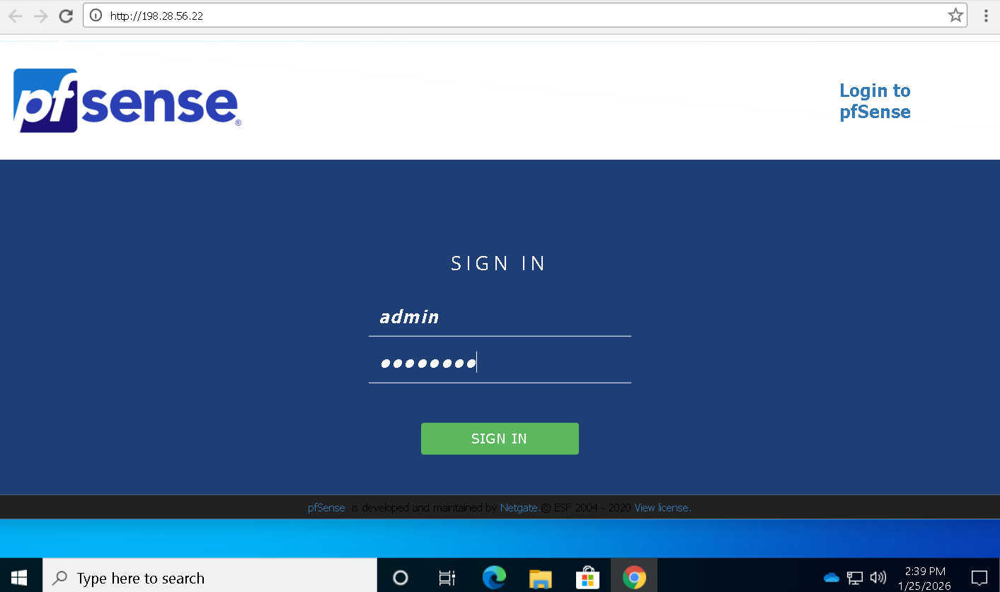
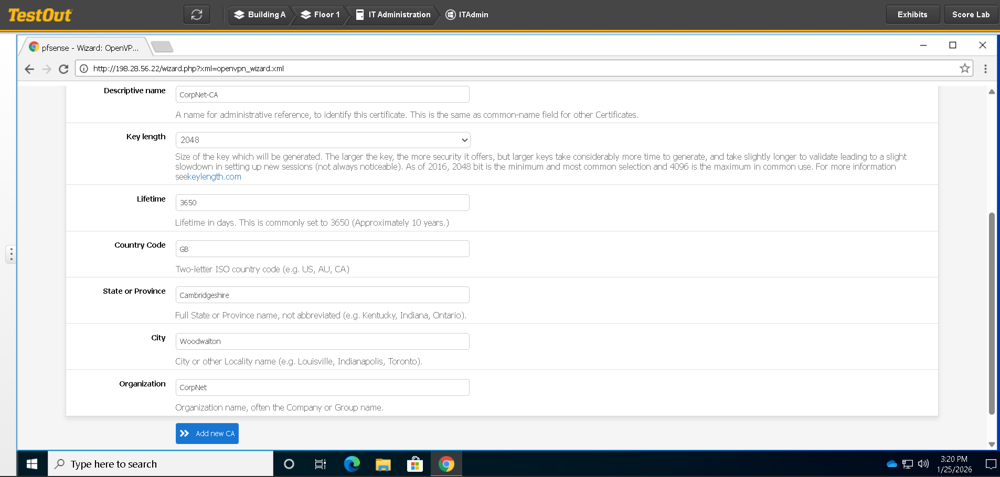
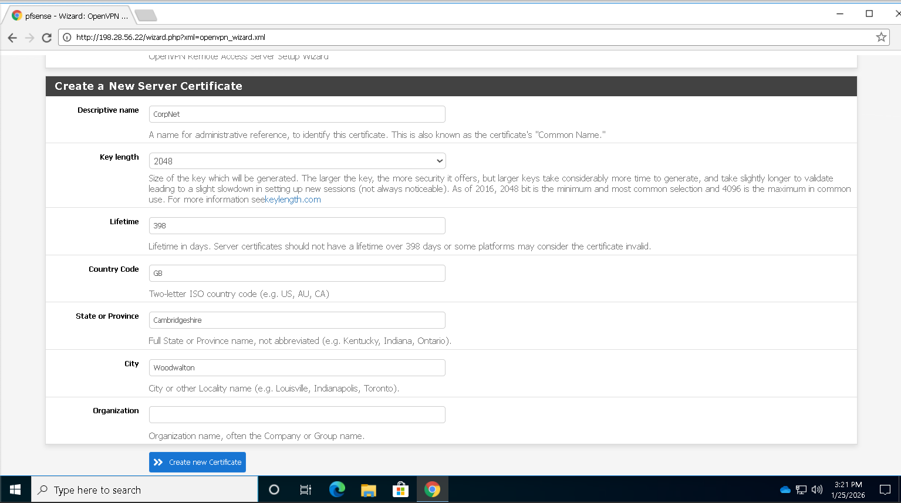
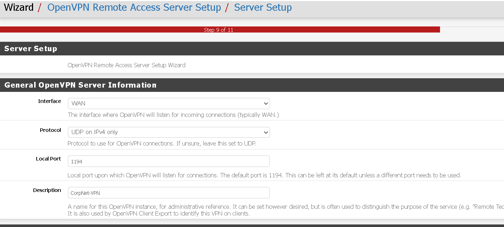
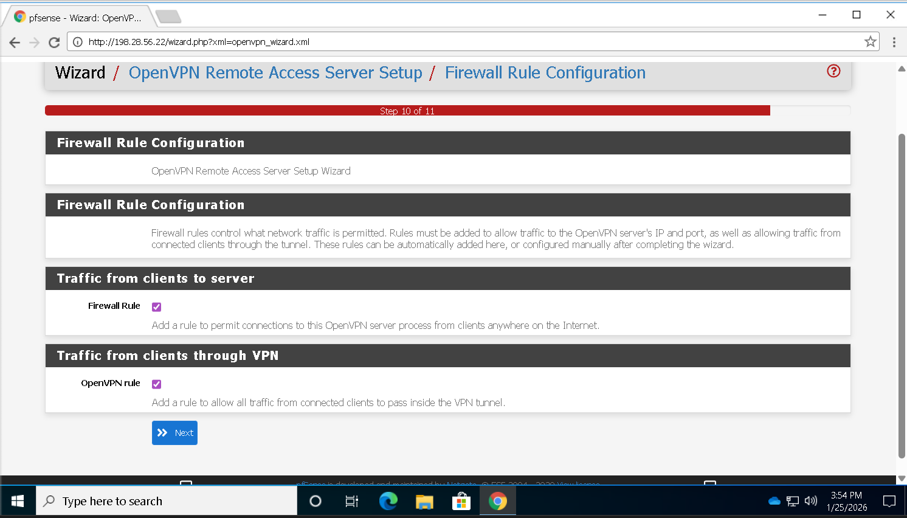
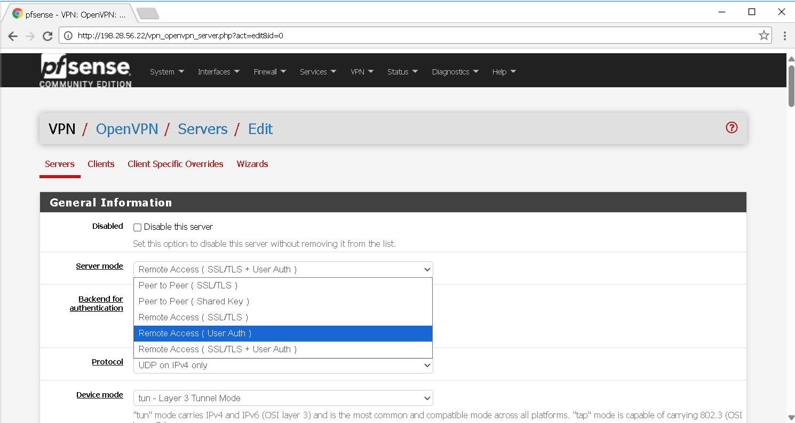
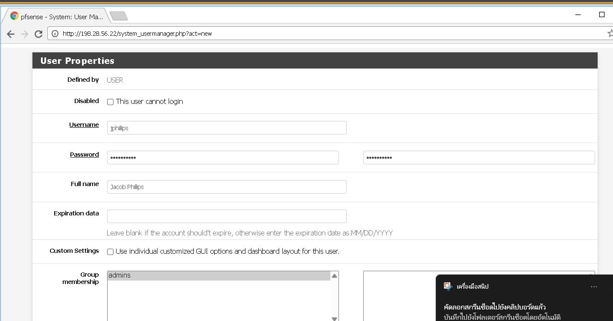
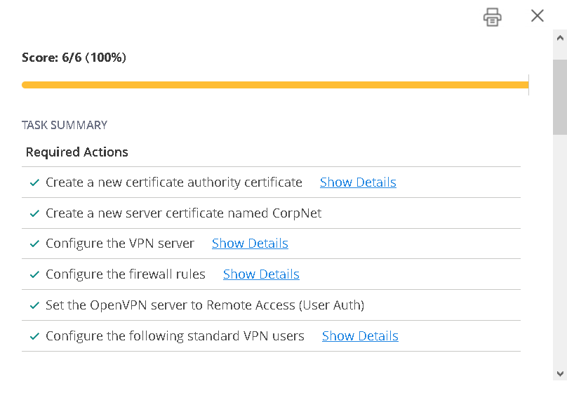

# 5.5.4 Configure_a_Remote_Access VPN
+ คุณทำงานเป็นผู้ดูแลระบบความปลอดภัยด้านไอที (IT Security Administrator) สำหรับเครือข่ายองค์กรขนาดเล็ก บางครั้งคุณและผู้ดูแลระบบคนอื่น ๆ จำเป็นต้องเข้าถึงทรัพยากรภายในองค์กรจากภายนอกสำนักงาน ดังนั้นคุณต้องการตั้งค่า Remote Access VPN โดยใช้ pfSense เพื่อให้สามารถเข้าถึงระบบได้อย่างปลอดภัย
+ ในแลบนี้ งานของคุณคือการใช้ pfSense wizard เพื่อสร้างและตั้งค่า OpenVPN Remote Access Server โดยมีเงื่อนไขดังต่อไปนี้
    
# Start Lab

  + 1.ข้อมูลการเข้าสู่ระบบ pfSense    
[User  :  admin ]
[Password : P@ssw0rd] 
  
  

  + 2.สร้าง Certificate Authority (CA) ใหม่ โดยใช้ค่าดังนี้

  

  + 3.สร้าง Server Certificate ใหม่ โดยใช้ค่าดังนี้

  

  + 4.ตั้งค่า VPN Server โดยใช้ค่าดังนี้

  

  + 5.การตั้งค่าเพิ่มเติม>- [x]  firewall rule - [x] OpenVPN rule

  

  + 6.ตั้งค่า OpenVPN Server ที่เพิ่งสร้างขึ้นให้เป็นแบบ Remote Access โดยใช้การยืนยันตัวตนด้วยผู้ใช้ (User Authentication)> edit > Server Mode > Remote Access

  

  + 7.เพิ่มบัญชีผู้ใช้สำหรับพนักงานหรือผู้ดูแลระบบ

  (5.5.4/UR2.png)

  + 8.จากนั้น กด Score Lab เพื่อเสร็จสิ้น Lab 5.5.4 Configure_a_Remote_Access VPN

  
