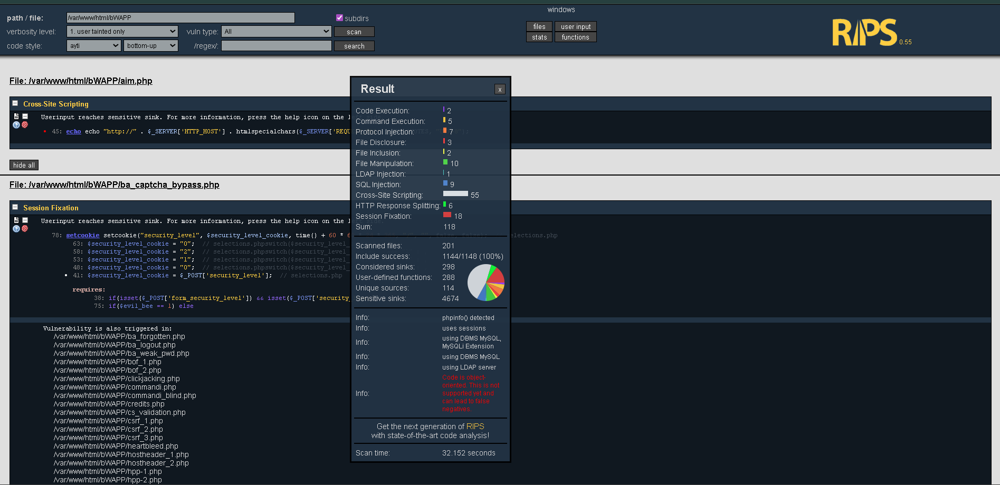
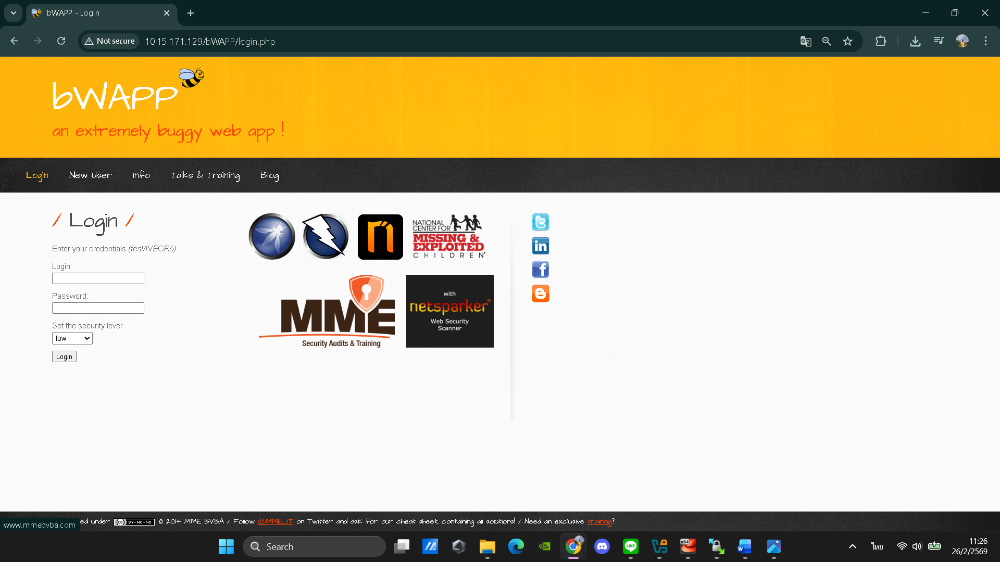
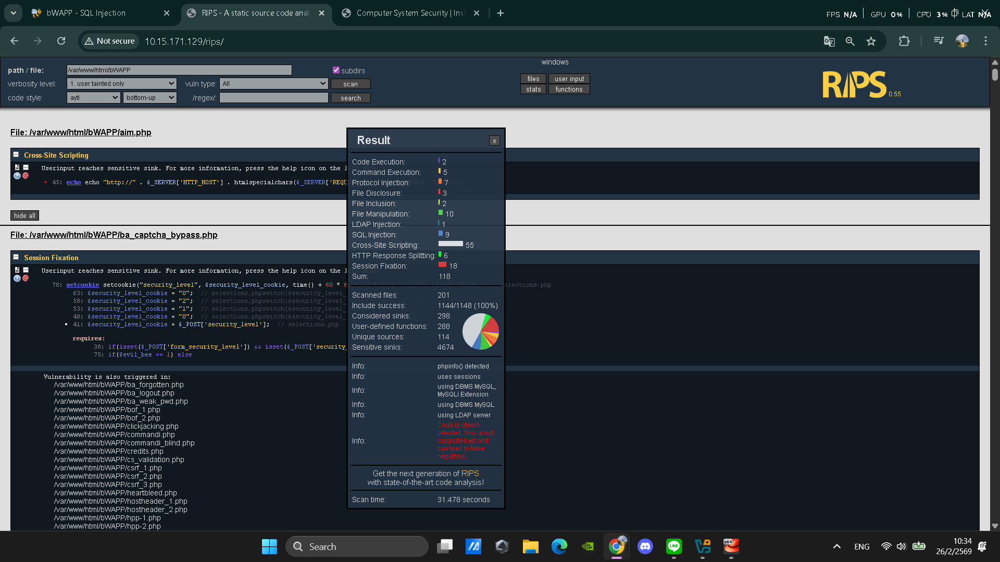
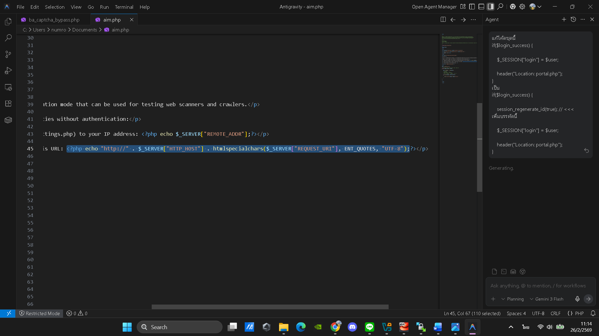
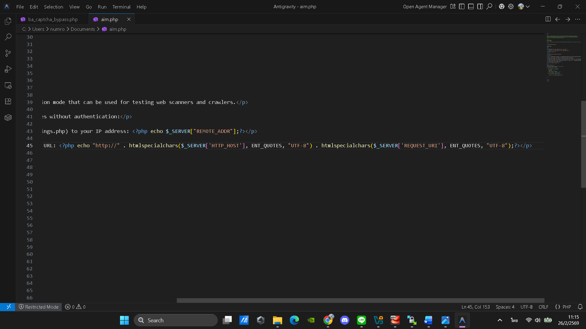
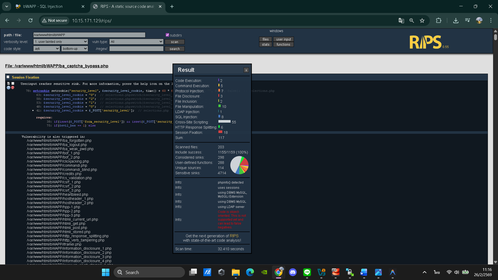

#  ___การจัดการช่องโหว่ SQL Injection (Login Form – User)___ 
## path/file : /var/www/html/bWAPP ในระบบ bWAPP (Buggy Web Application) 



---

# 1. ฟังก์ชันการทำงานเดิม (Business Function)
### หน้านี้มีไว้ทำอะไร?

หน้านี้มีฟังก์ชันสำหรับ ยืนยันตัวตนผู้ใช้งาน (User Authentication) เพื่อให้เฉพาะผู้ที่มีบัญชีถูกต้องเท่านั้นที่สามารถเข้าสู่ระบบได้

**กลไกการทำงาน:**
1.  **การรับค่า (Input Handling):** ผู้ใช้กรอก Username และ Password ลงในฟอร์ม
2.  **การส่งข้อมูล (Data Submission):** เมื่อกดปุ่ม Login ข้อมูลจะถูกส่งไปยังเซิร์ฟเวอร์ผ่าน HTTP Method (ส่วนใหญ่เป็น POST)
3.  **การประมวลผล (Server Processing):** เซิร์ฟเวอร์จะนำ Username และ Password ไปสร้างคำสั่ง SQL เพื่อตรวจสอบในฐานข้อมูล
4.  **การตอบกลับ (Response):**  ถ้าพบข้อมูลตรงกัน → อนุญาตให้เข้าสู่ระบบ    ถ้าไม่พบ → ปฏิเสธการเข้าใช้งาน
   
**สิ่งที่ควรจะเป็น (Security Expectation):**  ตรวจสอบข้อมูลอย่างปลอดภัย




---

# 2. ช่องโหว่และการทดสอบ (Vulnerability & Payload)
### ปัญหาอยู่ที่บรรทัดไหน?

จากการสแกนด้วยเครื่องมือ RIPS พบว่าโค้ดมีการสร้างคำสั่ง SQL แบบไม่ปลอดภัย โดยมีลักษณะดังนี้



#### ผลการสแกน (RIPS Output)

> Userinput reaches sensitive sink
45: echo "http://" . $_SERVER["HTTP_HOST"] . htmlspecialchars($_SERVER["REQUEST_URI"], ENT_QUOTES, "UTF-8");


### คำอธิบายปัญหา (Root Cause Analysis)

ช่องโหว่นี้เกิดจากการนำข้อมูลที่ผู้ใช้ควบคุมได้มาแสดงผลบนหน้าเว็บโดยไม่มีการป้องกันอย่างครบถ้วน

1.  **จุดรับข้อมูล (Source) - ตัวแปรจาก $_SERVER:**
   
   $_SERVER["HTTP_HOST"]
   $_SERVER["REQUEST_URI"]

ค่าทั้งสองนี้มาจาก HTTP Request ซึ่งผู้โจมตีสามารถดัดแปลงได้ เช่น
เปลี่ยนค่า Host Header
ใส่ Script ผ่าน URL

แม้ REQUEST_URI จะถูกครอบด้วย htmlspecialchars() แล้ว
แต่ HTTP_HOST ยังไม่ได้ถูกกรอง

2.  **จุดที่ข้อมูลถูกนำไปใช้ (Sink) - บรรทัดที่ 45:**

   echo "http://" . $_SERVER["HTTP_HOST"] . htmlspecialchars($_SERVER["REQUEST_URI"], ENT_QUOTES, "UTF-8");
   
**คำสั่ง echo คือจุดแสดงผลข้อมูล (Output)**
    **หากมี JavaScript ถูกแทรกเข้ามา ระบบจะสะท้อนกลับไปยังเบราว์เซอร์ทันที**
    
3.  **การตรวจสอบที่ไม่เพียงพอ:**

    **ไว้วางใจข้อมูลจาก HTTP Header มากเกินไป**
    **ไม่กรองค่าของ HTTP_HOST**
    **แสดงผลข้อมูลโดยตรงผ่าน echo**
    
---

# 3. การพิสูจน์ช่องโหว่ (Exploitation)
### ขั้นตอนการเจาะระบบ (Step-by-Step)

เพื่อให้เข้าใจการทำงานของช่องโหว่ เราจะจำลองพฤติกรรมของผู้โจมตีดังนี้:

1.  **การวิเคราะห์ URL:** จากไฟล์ aim.php พบบรรทัดที่ 45 ดังนี้ `echo "http://" . $_SERVER["HTTP_HOST"] . htmlspecialchars($_SERVER["REQUEST_URI"], ENT_QUOTES, "UTF-8");`
   
3.  **การทดสอบผ่าน URL:**ผู้โจมตีจะลองใส่ JavaScript ผ่าน URL เช่น**
   `[?language=/etc/passwd](http://target/aim.php/<script>alert('XSS')</script>)`
     **หรืออาจแก้ไขค่า HTTP Host Header ให้เป็น:**
    `[?language=/etc/passwd](http://target/aim.php/<script>alert('XSS')</script>)`
    
4.  **จุดประสงค์:** แสดงให้เห็นว่าผู้โจมตีสามารถรัน JavaScript บนเบราว์เซอร์ของผู้ใช้ได้ ซึ่งอาจนำไปสู่การขโมยข้อมูลสำคัญ เช่น Session Cookie

5.  **ผลลัพธ์ที่ได้:** แสดงว่าผู้โจมตีสามารถรัน JavaScript บนหน้าเว็บได้มไม่สำเร็จ 

---

# 4.แนวทางการแก้ไข (Remediation)
### แก้ยังไงให้หายขาด? (Best Practice)

ในกรณีนี้ ตัวแปร $_SERVER["HTTP_HOST"] และ $_SERVER["REQUEST_URI"] เป็นข้อมูลที่ผู้ใช้สามารถควบคุมได้ ดังนั้นก่อนนำไปแสดงผลผ่าน echo ต้องทำการเข้ารหัส HTML ให้ครบถ้วน

**ทำไมวิธีนี้ถึงปลอดภัย?**
1.  **ป้องกันการรัน JavaScript:** htmlspecialchars() แปลงอักขระพิเศษ เช่น < > " ' ให้เป็นข้อความธรรมดา ทำให้ Script ไม่ถูกประมวลผล
2.  **ควบคุมการแสดงผลข้อมูล (Output Encoding):** ข้อมูลจากผู้ใช้จะถูกเข้ารหัสก่อนแสดงผลเสมอ จึงลดความเสี่ยง XSS
3.  **ลดความเสี่ยงจากข้อมูลที่ควบคุมได้โดยผู้ใช้:** แม้ผู้โจมตีจะใส่ Payload ผ่าน URL หรือ Header ระบบจะแสดงเป็นข้อความ ไม่ใช่โค้ดที่ทำงานได้

```php
switch($_GET["language"]) {
    // ✅ echo htmlspecialchars(
    "http://" . $_SERVER["HTTP_HOST"] . $_SERVER["REQUEST_URI"],
    ENT_QUOTES,
    "UTF-8"
);

    // ❌ echo "http://" . $_SERVER["HTTP_HOST"] . htmlspecialchars($_SERVER["REQUEST_URI"], ENT_QUOTES, "UTF-8");
}
```
# โค้ดที่ยังไม่แก้ไข


# โค้ดที่แก้ไขแล้ว


---

# 5. การตรวจสอบหลังแก้ไข (Verification)
### มั่นใจได้อย่างไรว่าปลอดภัย?

หลังจากแก้ไขโค้ดแล้ว  ว่าระบบทำงานถูกต้อง:

## 5.1 ด้านคุณภาพโค้ด (Source Code Analysis)
*   **วิธีทดสอบ:** นำโค้ดที่แก้ไขแล้วไปสแกนใหม่ด้วยเครื่องมือ RIPS
*   **สิ่งที่คาดหวัง:** ไม่พบการแจ้งเตือน “User input reaches sensitive sink
  



# สรุป :

การดำเนินการแก้ไขช่องโหว่ Cross-Site Scripting (XSS) ในระบบ bWAPP เสร็จสิ้นสมบูรณ์ โดยได้ปรับปรุงโค้ดในไฟล์ aim.php ด้วยหลักการ Output Encoding ผ่านการใช้คำสั่ง htmlspecialchars() ครอบข้อมูลก่อนแสดงผล
การแก้ไขครั้งนี้สามารถป้องกันการรัน JavaScript ที่ถูกฝังผ่าน URL หรือ HTTP Header ได้อย่างมีประสิทธิภาพ ลดความเสี่ยงจากการถูกขโมย Session, การโจมตีแบบ Defacement และการ Redirect ผู้ใช้ไปยังเว็บไซต์อันตราย
